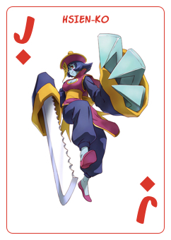
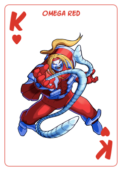

   

# Mega Super Hero Card Brawl

A donsol style card game with characters from Capcom's Fighting franchises. Responsive web, play on any device you like.

Made for fun! [Check out progress here](https://evilpaper.com/superherocardbrawl/)

Donsol is originally created by John Eternal. At least it seems. [Read the story here](https://boingboing.net/2015/04/16/the-clone-that-wasnt.html).

## Built with
HTML, CSS and vanilla JS.

## Contributions
Changes and improvements are more than welcome! Feel free to fork and open a pull request. Please make your changes in a specific branch and request to pull into master! If you can, please make sure the game fully works before sending the PR, as that will help speed up the process.

## Licensing
You are welcome to do whatever you want with the code. 
The graphical assets (images) are owned by Capcom Co.,Ltd. All rights reserved. I bet!

